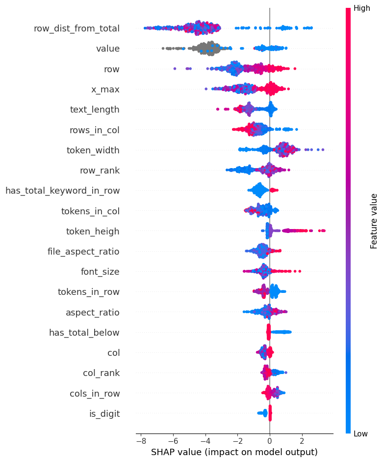

## Parse the total sum from recipt OCR data using xgboost classifier
In this project XGBoost model is trained using SROIE2019 Dataset: https://www.kaggle.com/code/ammarnassanalhajali/fine-tune-layoutlm-on-sroie-dataset

Dataset consists of recipt images (/img), OCR tokens with bbox (box/) and entities (entities/) like "total", "company" etc. for each image.
The goal was to identify token with total amout in a recipt. So, model was implemented as a binary classifier of tokens being total amount by recpit (1) or not (0).

Original data of bbox coordinates was tranformed into a set of spatial and semantic features like belonging certain area of a recipt (row, column), relative position to other tokens (row, column rank), distance to certain meaningful tokens tokens ("total", "sum", "amount").

Model parameters:
 - objective="binary:logistic"
 - n_estimators=500
 - learning_rate=0.1
 - max_depth=5
 - subsample=0.9
 - colsample_bytree=0.8
 - reg_lambda=1.0
 - use_label_encoder=False
 - early_stopping_rounds=50

Early stopping was used to prevent overfitting and trainig proccess control. For that purpose 20% of test data were used as validation set.

### Model Evaluation:
- Accuracy: 0.99
- ROC_AUC: 0.933

| Class | Precision | Recall | F1-Score |
|--------|---|---|---|
|0 | 0.997 | 0.992 | 0.994 |
|1|0.67|0.87|0.76|

Model perform considerably well. Unrelated data recoznized quite accurately. The weakest part is Precision for target class=0.67 e.g. some tokes confused with total. Recall look much better, so missing total is less likely to happen.

The result above was achived with fixed model parameters, but iteratively using different combination of attributes based on their impact on model outputs. 
Feature importance estimated using SHAP analysis.
As seen from final shap summary plot below, all selected features help to ditinguish classes and top important features are very relatable for given task: model heavily rely on row distance from keyword like "Total", value (if token is numeric) row and x_max (total is usually in lower right corner). 

Testing on never seen set of local recipts was also successfull (10/10).

### Precision problem

As mentioned above, the bigget problem of a model is precision. Why it happen? Well, there are several reasons. Use case analysis shows that indeed model more likely to mistake 
- when it has unusual keyword for total (very likely for different countries and local languages) 
- recipt structure is unusual, sometimes total may be in the top part of receipt
- same or similar value may appear several times and close to each other (like rounded total, before/after taxes etc.)
- recipt image is very low quality, so features are broken

In some cases even when modeule is not aware of keyword or total is confused with rounded or after tax total, the actual output - number - is technically correct and for applicatons where value precision is not dramatically critical model as is can perform well. Also some simple rules on preprocessing step like filtering out non numeric values may improve perfomance. Even if not dramatically but at small cost.
Obviously, model evolution by adding failure cases ito training helps to improve quality and should be applied in production. 
Another issue is that approach lacking semantic features that obviously is very relevant for use case.

### Next steps

Considering issues mentioned next steps of model improvement should be:
 - hyperparameter tuning with crossvalidation to find the most appropriate combination
 - further development of features by adding more semantic features
 - use some recipt clustering by similar structure and use it as a feature for XGB classifier 
- benchmarking with non-ML approach (regex+distance from total keyword) and Deep Learning model (LayoutML) in accuracy and performance.

